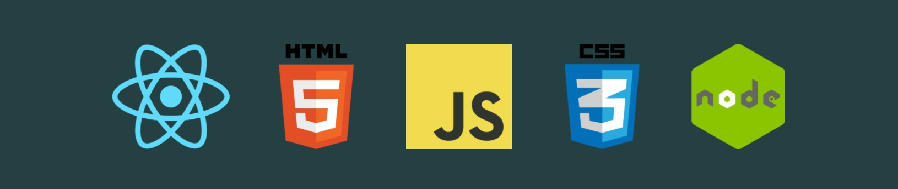

<!--
**AmMiRo/AmMiRo** is a ✨ _special_ ✨ repository because its `README.md` (this file) appears on your GitHub profile.

Here are some ideas to get you started:

- 🔭 I’m currently working on ...
- 🌱 I’m currently learning ...
- 👯 I’m looking to collaborate on ...
- 🤔 I’m looking for help with ...
- 💬 Ask me about ...
- 📫 How to reach me: ...
- 😄 Pronouns: ...
- ⚡ Fun fact: ...
-->

# Hi, I'm Amos

I am a full-stack developer with 10+ years of experience as a healthcare professional

## Here is where you can find me

🌐 https://amosrose.co

💼 https://www.linkedin.com/in/amos-rose/

## Here is a little about me

I'm a full-stack developer with 10+ years of experience as a healthcare professional.

Since 2009 I've worked as a technologist in Radiology departments for health systems all across the Front Range in Colorado. I starting as a Staff Radiographer and moved into positions as a Clinical Instructor, Surgical Radiographer, and Interventional Radiographer. I loved working on cross-functional teams in high-demand environments to deliver time sensetive services. I was finding success, but unsure of what my future in healthcare would look like. I wanted to work in an environement where my creativity and drive to learn new technologies and systems would be greater assets to my professional development. That is when I found Lambda School.

In late 2019 I enroled as a full-time student in Lambda School's full-stack web-development course. On top of teaching me about technologies like JavaScript, Python, React, Node.js, HTML, and CSS, Lambda showed me the value that my creativity and lifestyle of learning could bring.

As I am stepping out into the world with these new skills, I am excited as to what my future as a developer will bring.
